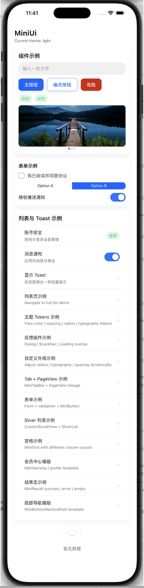
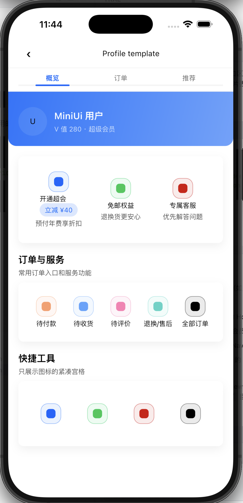
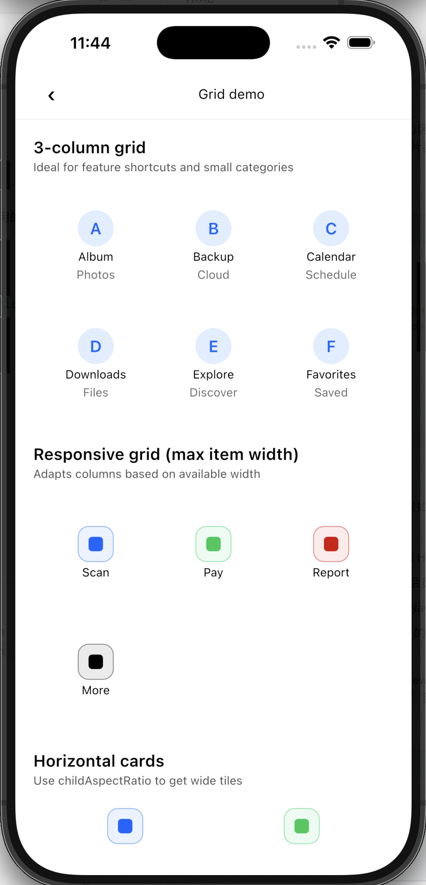
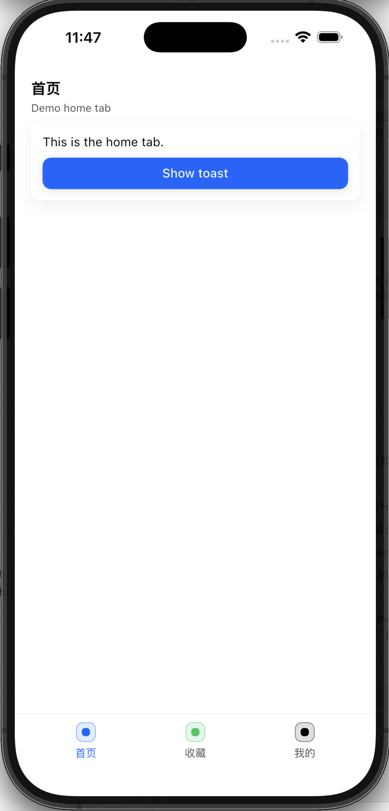

# MiniUi Component

一个基于 Flutter 的 UI 组件库，不依赖 `material.dart`。

This repo 既包含组件实现，也包含一个完整的示例 App（在 `example/` 目录），推荐直接跑 example 来体验所有组件和模版页。

---

## Features

- **No Material dependency**
  - 仅依赖 `package:flutter/widgets.dart`
  - 基于 `WidgetsApp + Directionality` 的入口

- **Theme + token 系统**
  - 统一的 `MiniTheme`：颜色 / 间距 / 圆角 / 字体 / 组件尺寸
  - 内置多套主题（light / dark / blue / red / festival）
  - `MiniThemeController` 支持运行时切换主题

- **常用组件覆盖**
  - Display：MiniText / MiniCard / MiniImage / MiniTag / MiniEmpty / MiniLoading / MiniResult
  - Input / Form：MiniButton / MiniInput / MiniTextArea / MiniCheckbox / MiniRadio / MiniSwitch / MiniStepper / MiniSearchBar / MiniSlider
  - List & Data：MiniDivider / MiniListItem / MiniAvatar / MiniBadge / MiniSkeleton / MiniGrid
  - Navigation & Layout：MiniAppBar / MiniTabBar / MiniTabView / MiniPageScaffold / MiniBottomNavScaffold / MiniBackButton
  - Feedback：MiniToast / MiniDialog / MiniSnackbar / MiniLoadingOverlay / MiniBottomSheet / MiniBanner

---

| Home & Theme | Profile 模版 | Grid & BottomNav |
| ------------ | ------------ | ---------------- |
|  |  |  |  |

---

## Install

`pubspec.yaml` 中添加依赖（已发布到 pub.dev 后）：

```yaml
dependencies:
  flutter:
    sdk: flutter

  miniui_component: ^0.0.3
```

---

## Quick Start（最小示例，无 `material.dart`）

```dart
import 'package:flutter/widgets.dart';
import 'package:miniui_component/miniui.dart';

void main() {
  final controller = MiniThemeController(initialTheme: MiniThemes.light);

  runApp(
    Directionality(
      textDirection: TextDirection.ltr,
      child: AnimatedMiniTheme(
        theme: controller.theme,
        duration: const Duration(milliseconds: 220),
        child: WidgetsApp(
          color: controller.theme.colors.background,
          builder: (context, _) => Center(
            child: MiniButton(
              label: 'Hello MiniUi',
              onPressed: () {},
            ),
          ),
        ),
      ),
    ),
  );
}
```

更多用法（多主题、表单、列表、模版页），请直接参考 `example/` 中的示例代码。

---

## Demos（示例 App）

示例 App 入口：[`example/lib/main.dart`](example/lib/main.dart)

在项目根目录运行：

```bash
flutter run -t example/lib/main.dart
```

主要示例页面都在 [`example/lib/demo/`](example/lib/demo) 目录中，例如：

- Home 页：[`home_page.dart`](example/lib/demo/home_page.dart)
- 列表示例：[`list_page.dart`](example/lib/demo/list_page.dart)
- 主题 Tokens：[`tokens_page.dart`](example/lib/demo/tokens_page.dart)
- 反馈组件：[`feedback_page.dart`](example/lib/demo/feedback_page.dart)
- 自定义外观：[`custom_tokens_page.dart`](example/lib/demo/custom_tokens_page.dart)
- Tab + PageView：[`tab_view_page.dart`](example/lib/demo/tab_view_page.dart)
- Sliver 列表：[`sliver_page.dart`](example/lib/demo/sliver_page.dart)
- 宫格示例：[`grid_page.dart`](example/lib/demo/grid_page.dart)
- 会员中心模版：[`profile_page.dart`](example/lib/demo/profile_page.dart)
- 结果态示例：[`result_page.dart`](example/lib/demo/result_page.dart)
- 底部导航模版：[`bottom_nav_page.dart`](example/lib/demo/bottom_nav_page.dart)

这些页面基本覆盖了真实 App 常见场景，建议直接在 example 里按需“抄模版”到自己的项目。

---

## Components Overview

所有组件统一从 [`lib/miniui.dart`](lib/miniui.dart) 导出：

```dart
import 'package:miniui_component/miniui.dart';
```

在 IDE 中跳转到 `miniui.dart` 可以快速浏览所有公开组件；更详细的使用方式请参考上面对应的 example 源码。

---

## i18n / Localization

MiniUi 内置了一个简单的本地化层 [`MiniLocalizations`](lib/core/localization/mini_localizations.dart)，目前支持：

- 支持的语言：`zh` / `en`
- 主要用于示例 App 的文案（首页标题、按钮文案等）

在示例 App 中的集成方式（见 [`example/lib/main.dart`](example/lib/main.dart)）：

```dart
WidgetsApp(
  color: theme.colors.background,
  localizationsDelegates: const <LocalizationsDelegate<dynamic>>[
    MiniLocalizations.delegate,
  ],
  supportedLocales: MiniLocalizations.supportedLocales,
  localeListResolutionCallback:
      (List<Locale>? locales, Iterable<Locale> supported) {
    final Locale? device = locales != null && locales.isNotEmpty
        ? locales.first
        : null;
    if (device == null) {
      return const Locale('en');
    }
    final String code = device.languageCode.toLowerCase();
    if (code == 'zh') {
      return const Locale('zh');
    }
    return const Locale('en');
  },
  ...
);
```

组件自身不会强绑定任何语言，只在需要文案的示例页中通过：

```dart
final MiniLocalizations i18n = MiniLocalizations.of(context);
```

来获取多语言字符串。如果你在业务里使用 MiniUi，可以继续沿用自己的 i18n 方案；`MiniLocalizations` 主要是为了让 example 根据系统语言自动在中英文之间切换。

---

## Development

运行示例 App：

```bash
flutter run -t example/lib/main.dart
```

运行测试：

```bash
flutter test
```

核心 Theme / Tokens 定义在 [`lib/core/utils/tokens.dart`](lib/core/utils/tokens.dart)，Theme 注入和组件基类在 [`lib/core/base/base_component.dart`](lib/core/base/base_component.dart)。如果需要自定义皮肤或尺寸，可以从这里开始阅读代码。
